<h1 align="center">Acrocity Chat</h1>

<p align="center">社内向け生成AIチャットサービス — 利用者ガイド</p>

このドキュメントは **Acrocity Chat を使う方** に向けた案内です。
セットアップや内部構成の説明は含みません。使い方だけを順番にまとめています。

> [!NOTE]
> このガイドのコマンドは **Windows 端末（PowerShell）** を前提に記載しています。

## 目次

1. [Acrocity Chat とは](#1-acrocity-chat-とは)
2. [接続する方法](#2-接続する方法)
3. [アカウント登録方法](#3-アカウント登録方法)
4. [チャットの開始方法](#4-チャットの開始方法)
5. [公開APIの使用方法](#5-公開apiの使用方法)
6. [Claude Code on Bedrock の使用方法](#6-claude-code-on-bedrock-の使用方法)
7. [困ったときは](#7-困ったときは)

---

## 1. Acrocity Chat とは

Acrocity Chat は、**社内利用のために用意された生成AIチャットサービス**です。
ブラウザを開いてメッセージを送るだけで、Claude シリーズのAIモデルと日本語で対話できます。

### できること

| できること | 概要 |
|---|---|
| チャット | 質問・要約・文章作成・翻訳・コード相談などをAIと対話しながら進められます |
| ファイルを渡して相談 | PDF・Word・Excel・テキスト・ソースコードなどを添付して、その内容について質問できます |
| 画像について質問 | 画像を貼り付けて、内容の説明や読み取りを依頼できます（画像対応モデル選択時） |
| モデルの切り替え | 用途に応じて、応答が速いモデルと、じっくり考える高性能モデルを選べます |
| 「深い思考」モード | 複雑な問題では、AIが考える過程を経てから回答するモードを有効にできます |
| チャット履歴 | 過去のやりとりが自動で保存され、あとから検索・再開できます |
| ボット | 用途ごとに設定済みのAI（ボット）が共有されている場合、それを選んで会話できます |

### 3つの利用形態

用途に応じて、次の3通りの使い方があります。

| 利用形態 | 向いている用途 | 必要なもの |
|---|---|---|
| **チャット画面**（→ [4章](#4-チャットの開始方法)） | 日常的な質問・作業相談 | アカウントのみ |
| **公開API**（→ [5章](#5-公開apiの使用方法)） | 自作ツールや業務システムからAIを呼び出す | 管理者から受け取るAPIキー |
| **Claude Code on Bedrock**（→ [6章](#6-claude-code-on-bedrock-の使用方法)） | 手元の端末でコーディングをAIに任せる | 管理者から受け取るアクセスキー |

### 利用上の注意

- 会社のルールで取り扱いが制限されている情報（個人情報・顧客の機密情報など）の入力可否は、社内の利用規程に従ってください。
- 利用量には **5時間** と **7日間** の上限があります。上限に達すると一時的に利用できなくなり、時間の経過とともに自動的に回復します。現在の消費状況は画面左下に表示されます。

  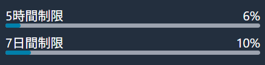

- AIの回答は誤りを含むことがあります。重要な判断に使う内容は必ず裏付けを確認してください。

---

## 2. 接続する方法

### アクセス先

ブラウザで、管理者から案内されているURLを開きます。

```
https://<管理者から案内されたURL>/
```

> [!NOTE]
> URLが分からない場合は、社内の管理者にお問い合わせください。ブックマークしておくと便利です。

### 必要な環境

- **OS**: Windows 10 / Windows 11
- **ブラウザ**: Microsoft Edge または Google Chrome（いずれも最新版）
- **ネットワーク**: 通常のインターネット接続（専用のVPNやクライアント証明書は不要です）
- インストールが必要なソフトウェアはありません

スマートフォン・タブレットのブラウザからも同じURLで利用できます。

### アプリとしてインストールする（任意）

Acrocity Chat はブラウザからアプリとしてインストールできます。タブを探さずにデスクトップから起動できるようになります。

- **Microsoft Edge**: アドレスバー右側のインストールアイコン、または「…」→「アプリ」→「このサイトをアプリとしてインストール」
- **Google Chrome**: アドレスバー右側のインストールアイコン、または「⋮」メニューからインストールを選択

---

## 3. アカウント登録方法

初回のみ、自分でアカウントを作成します。所要時間は5分程度です。

### 手順

1. アクセス先のURLを開き、サインイン画面の **「アカウントを作る」** タブを選びます。

   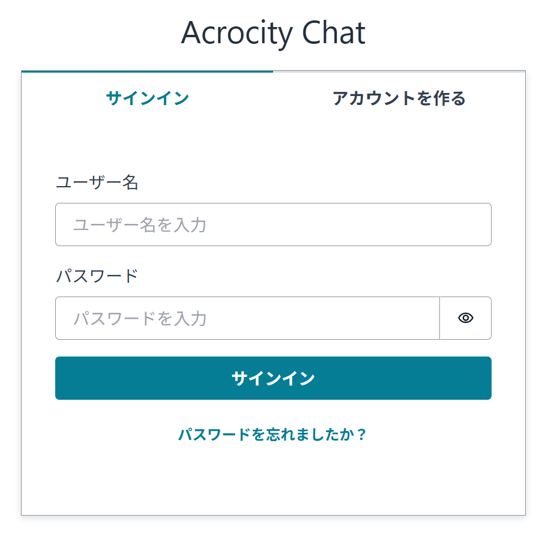

2. 会社のメールアドレスとパスワードを入力し、**「アカウントを作る」** を押します。

   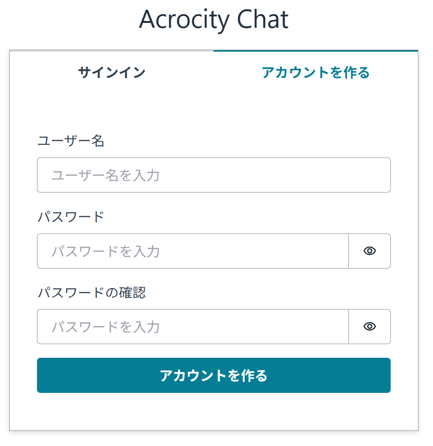

   - **ユーザー名**: 会社のメールアドレスを入力します。`@gyoseiq.co.jp` のアドレスのみ登録できます。他のドメインのアドレスではエラーになります。
   - **パスワード** / **パスワードの確認**: 同じパスワードを2回入力します。パスワードは次の条件をすべて満たす必要があります。
     - 8文字以上
     - 英大文字を含む
     - 数字を含む
     - 記号を含む

3. 入力したメールアドレスに **確認コード** が届きます。「確認コード」欄にコードを入力し、**「確定」** を押して登録を完了します。

   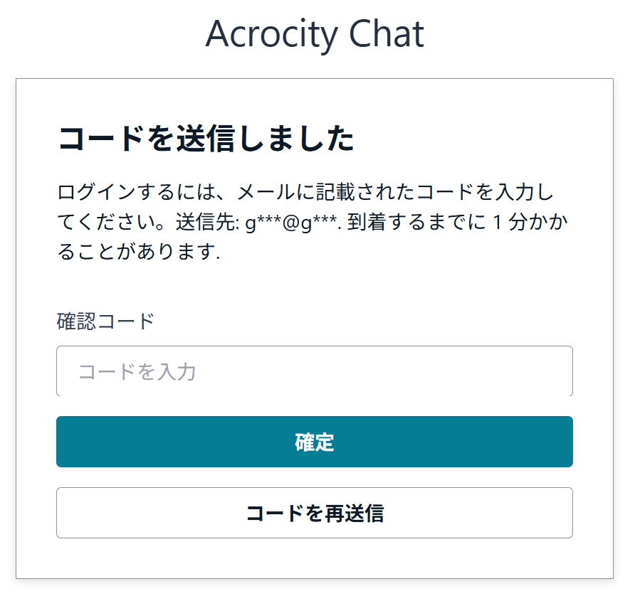

   数分待っても届かない場合は、迷惑メールフォルダを確認してください。届いていなければ **「コードを再送信」** を押します。

4. **管理者の承認を待ちます。**

   確認コードの入力が終わった時点では、まだサインインできません。この状態でサインインすると次のメッセージが表示されます。

   > アカウントは管理者の承認待ちです。管理者が承認するまでお待ちください。

   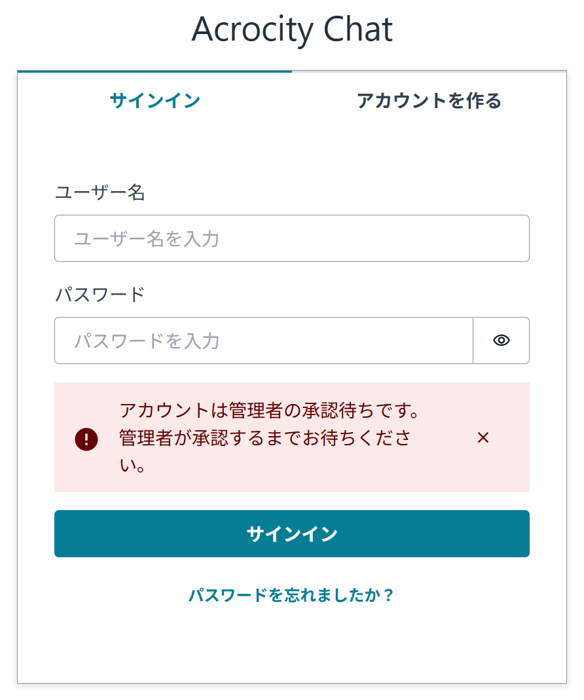

   管理者に登録した旨を連絡し、承認されるまでお待ちください。

5. 承認後、登録したメールアドレスとパスワードで **サインイン** できます。

### パスワードを忘れた場合

サインイン画面の **「パスワードを忘れましたか？」** から、メールアドレスを入力して再設定します。確認コードがメールで届きます。

### 追加の権限が必要な場合

標準のアカウントでチャットはすべて利用できます。次のことをしたい場合は管理者に依頼してください。

| やりたいこと | 依頼内容 |
|---|---|
| 自分専用のボット（社内文書を読ませたボットなど）を作る | ボット作成権限（`CreatingBotAllowed`）の付与を依頼 |
| 外部のツールやシステムからAPIで呼び出す | ボットのAPI公開とAPIキーの発行を依頼（→ [5章](#5-公開apiの使用方法)） |
| Claude Code を使う | Bedrock用アクセスキーの払い出しを依頼（→ [6章](#6-claude-code-on-bedrock-の使用方法)） |

---

## 4. チャットの開始方法

### 画面の構成

サインインすると、左側にサイドメニュー、右側にチャット画面が表示されます。

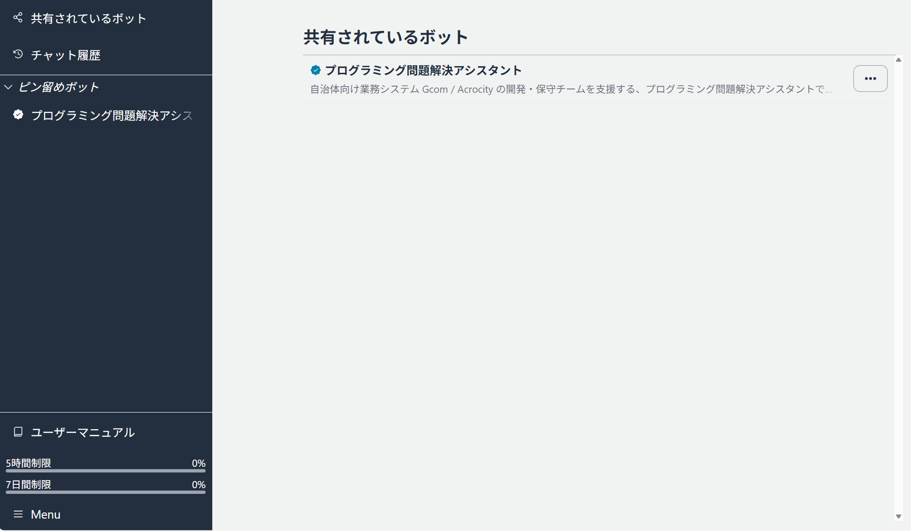

サイドメニューの主な項目:

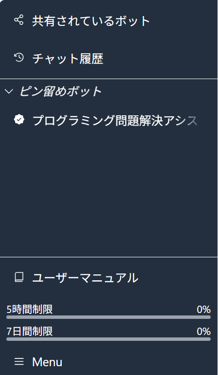

- **共有されているボット** — 社内で共有されているボットの一覧。用途に合ったボットを選んで会話を始められます。
- **チャット履歴** — 過去のチャットの一覧。ここから会話を再開したり、キーワードで検索したりできます。
- **ピン留めボット** — よく使うボットが上部に表示されます。
- **ユーザーマニュアル** — アプリ内で読める利用ガイド（このドキュメントの要約版）。
- **利用状況** — 5時間制限／7日間制限の消費状況。
- **メニュー（画面左下）** — 言語の切替、すべての会話のクリア、サインアウトなど。

### 会話を始める

1. **新しいチャットを開く**

   サイドメニュー上部の **ロゴをクリック** すると、いつでも新しいチャットが開きます。「チャット履歴」ページの **「新しいチャット」** ボタンからも開始できます。
   特定のボットと話したい場合は、「共有されているボット」から選択してください。

   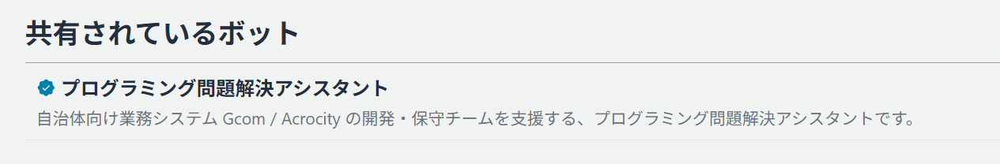

2. **モデルを選ぶ（任意）**

   画面上部でAIモデルを切り替えられます。迷った場合は初期選択のままで問題ありません。

   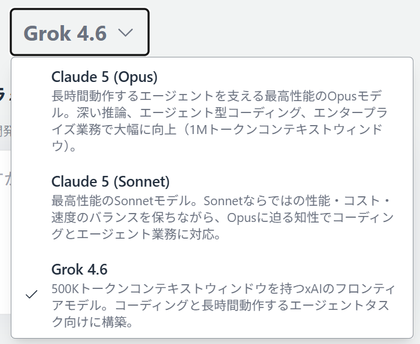

   - 速さ重視の軽いモデル: 短い質問、定型的な作業
   - 高性能モデル: 長文の読解、複雑な調査・設計・コーディング

3. **メッセージを入力して送信する**

   画面下部の入力欄に文章を入力し、送信します。

   - **Enter** で送信
   - **Shift + Enter** で改行

4. **回答を受け取る**

   回答は生成されながら順次表示されます。生成が途中で止まった場合は **「生成を続ける」**、回答が気に入らない場合は **「再生成」** を使えます。

   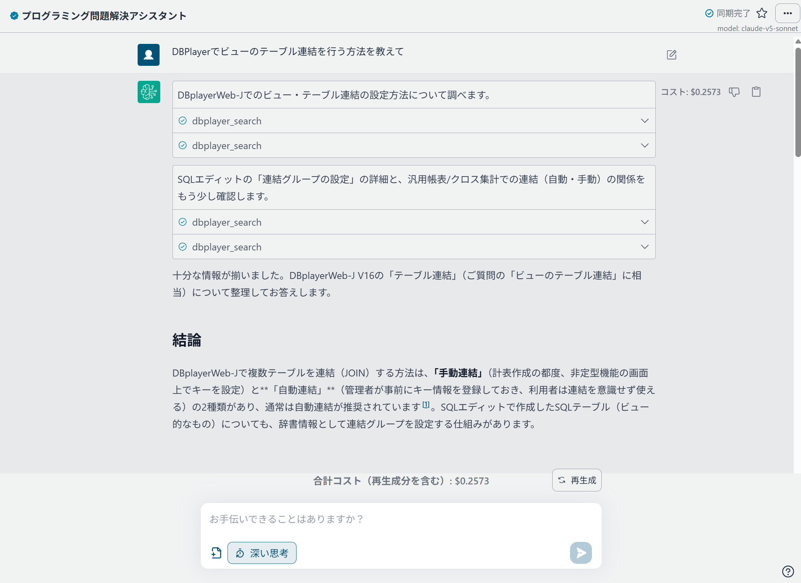

### ファイルを添付して質問する

入力欄のファイル選択ボタンから、またはファイルを画面に **ドラッグ＆ドロップ** して添付できます。

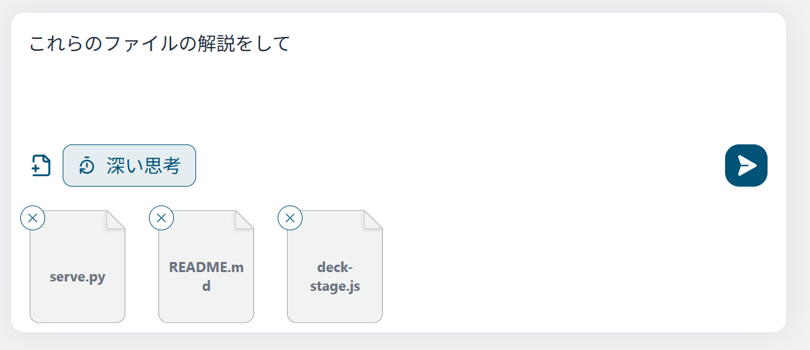

- **添付できる形式**: PDF / Word（.doc, .docx）/ Excel（.xls, .xlsx）/ テキスト（.txt, .md, .csv, .log など）/ 各種ソースコード・設定ファイル（.py, .ts, .java, .json, .yaml など）
- **上限**: 1回のメッセージで **5ファイルまで**、1ファイル **4.5MBまで**
- **画像**: 画像対応モデルを選択している場合、画像ファイルの添付やクリップボードからの貼り付けができます

### 「深い思考」を使う

入力欄付近の **「深い思考」** を有効にすると、AIが回答前に考える過程を挟みます。難しい推論や設計の相談に向いています。回答後は「思考過程」から、その内容を確認できます。
（対応しているモデルを選択している場合に表示されます）

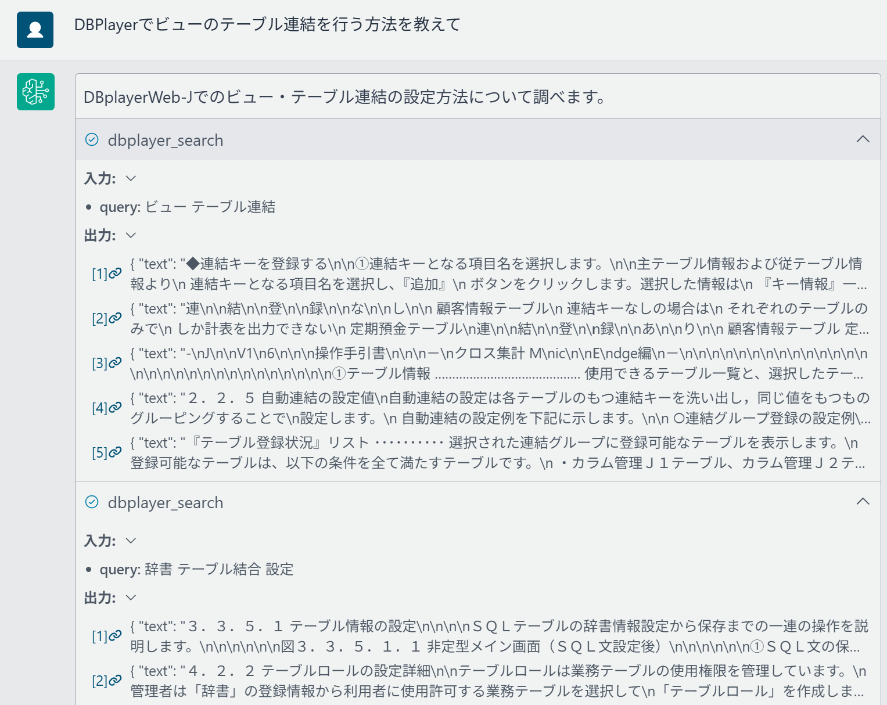

### 履歴の管理

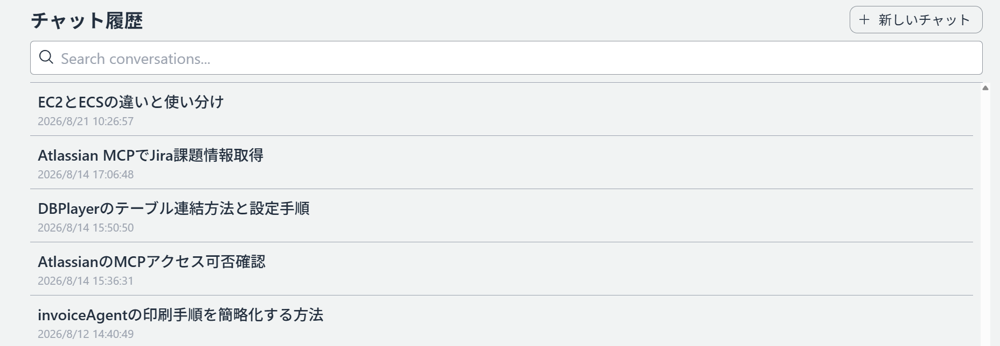

- チャットのタイトルは自動で付きます。
- 「チャット履歴」ページの検索欄から、過去のやりとりをキーワードで探せます。
- 個別のチャットは一覧から削除できます。
- すべての履歴を消したい場合は、画面左下のメニューから「すべての会話をクリア」を選びます。

---

## 5. 公開APIの使用方法

自作のツールや業務システムから、Acrocity Chat のボットをHTTP経由で呼び出せます。
以下のコマンド例は **Windows PowerShell** 用です。

### 全体の流れ

```
① 管理者にAPIキーの発行を依頼
        ↓
② 管理者から エンドポイントURL / APIキー を受け取る
        ↓
③ PowerShell やプログラムから呼び出す
```

### ① 管理者にAPIキーの発行を依頼する

APIとして呼び出せるのは、**管理者がAPI公開の設定を行ったボット** のみです。公開の操作とAPIキーの発行は管理者が行うため、利用したい場合は管理者に依頼してください。

依頼するときは、次の内容を伝えるとスムーズです。

- 利用したいボット（または「通常のチャットと同じ動作でよい」など）
- 用途（どのシステム・ツールから呼び出すか）
- 想定する呼び出し頻度（管理者がレート上限を設定する際の参考になります）
- 利用者（自分のアカウントのメールアドレス）

### ② エンドポイントURLとAPIキーを受け取る

管理者から次の情報を受け取ります。

- **エンドポイントURL**（例: `https://xxxxxxxxxx.execute-api.us-east-1.amazonaws.com/api`）
- **APIキー**

> [!IMPORTANT]
> APIキーはパスワードと同じ扱いです。メールやチャットに貼ったまま放置せず、社内のシークレット管理ルールに従って保管してください。漏えいの可能性がある場合は、ただちに管理者に連絡してキーの無効化を依頼してください。

### ③ 呼び出しの準備

PowerShell を開き、取得した情報を変数に入れておきます。APIキーはリクエストヘッダー `x-api-key` で渡します。

```powershell
$ApiEndpoint = "https://xxxxxxxxxx.execute-api.<region>.amazonaws.com/api"
$ApiKey      = "xxxxxxxxxxxxxxxxxxxxxxxxxxxxxxxx"
$Headers     = @{ "x-api-key" = $ApiKey }
```

> [!NOTE]
> 業務システムに組み込む場合は、APIキーをソースコードに直接書かず、環境変数やシークレット管理の仕組みから読み込むようにしてください。

### 呼び出せるAPI

#### 1. メッセージを送信する（`POST /conversation`）

このAPIは **非同期** です。回答の生成には時間がかかるため、リクエストは即座に `conversationId` と `messageId` だけを返し、回答は裏側で生成されます。

```powershell
$Payload = @{
  message = @{
    content = @(
      @{ contentType = "text"; body = "こんにちは" }
    )
    model = "claude-v5-sonnet"
  }
} | ConvertTo-Json -Depth 5

$Requested = Invoke-RestMethod -Method Post `
  -Uri "$ApiEndpoint/conversation" `
  -Headers $Headers `
  -ContentType "application/json" `
  -Body ([System.Text.Encoding]::UTF8.GetBytes($Payload))

$Requested
```

出力例:

```
conversationId messageId
-------------- ---------
01J...         01J...
```

> [!NOTE]
> 日本語を送るときは、上の例のように本文を `[System.Text.Encoding]::UTF8.GetBytes(...)` でUTF-8のバイト列に変換して渡してください。文字列のまま渡すと文字化けする場合があります。

`model` に指定できるモデルは次の3つです。

| 指定する値 | 特徴 |
|---|---|
| `claude-v5-opus` | 最も高性能。複雑な調査・設計・コーディングなど、難易度の高い依頼向け |
| `claude-v5-sonnet` | 性能と速度のバランス型。日常的な依頼はこれで十分 |
| `grok-4.6` | 上記とは別系統のモデル。用途に応じて使い分け |

#### 2. 回答を取得する（`GET /conversation/{conversationId}/{messageId}`）

メッセージ送信で返ったIDを使って、生成が完了するまで一定間隔でポーリングします。

```powershell
$ConversationId = $Requested.conversationId
$MessageId      = $Requested.messageId

Invoke-RestMethod -Method Get `
  -Uri "$ApiEndpoint/conversation/$ConversationId/$MessageId" `
  -Headers $Headers
```

生成が完了するまで待ってから取得する例（5秒間隔で最大30回リトライ）:

```powershell
for ($i = 0; $i -lt 30; $i++) {
  try {
    $Answer = Invoke-RestMethod -Method Get `
      -Uri "$ApiEndpoint/conversation/$ConversationId/$MessageId" `
      -Headers $Headers
    $Answer.message.content.body
    break
  } catch {
    Start-Sleep -Seconds 5
  }
}
```

#### 3. 会話全体を取得する（`GET /conversation/{conversationId}`）

```powershell
Invoke-RestMethod -Method Get `
  -Uri "$ApiEndpoint/conversation/$ConversationId" `
  -Headers $Headers
```

### 注意点

- APIキーが特定の利用者に紐づけて発行されている場合、その利用者の利用量上限（5時間／7日間）が適用されます。
- 管理者が設定したスロットリング（呼び出しレートの上限）を超えると、リクエストが拒否されます。上限を上げたい場合は管理者に相談してください。
- APIキーの追加・無効化も管理者の操作となります。

---

## 6. Claude Code on Bedrock の使用方法

**Claude Code** は、ターミナルからAIにコーディングを任せられるコマンドラインツールです。
Acrocity Chat の環境では、社内のAmazon Bedrock経由で Claude Code を利用できます。
以下の手順は **Windows 端末（PowerShell）** 向けです。

### 全体の流れ

```
① 管理者にアクセスキーの発行を依頼
        ↓
② 管理者から AccessKeyId / SecretAccessKey を受け取る
        ↓
③ Claude Code をインストール
        ↓
④ 環境変数を設定して起動
```

### ① アクセスキーを受け取る

アカウント登録時に、Bedrockを呼び出すための専用のアクセスキーが自動で発行され、社内のAWS環境に安全に保管されています。

このキーは長期間有効な認証情報のため、**自分で画面から取得することはできません。管理者に依頼して受け取ってください。**
受け取ったキーは他人と共有せず、社内のシークレット管理ルールに従って保管してください。

管理者から受け取る情報:

- `AccessKeyId`
- `SecretAccessKey`
- 利用するリージョン（例: `us-east-1`）
- 指定するモデルID

### ② Claude Code をインストールする

Windows では次のいずれか1つの方法でインストールします。**PowerShell を開いて** 実行してください（管理者権限は不要です）。

**方法A: 公式インストーラー（推奨）**

```powershell
irm https://claude.ai/install.ps1 | iex
```

**方法B: WinGet**

```powershell
winget install Anthropic.ClaudeCode
```

**方法C: npm（Node.js 22以降が入っている場合）**

```powershell
npm install -g @anthropic-ai/claude-code
```

インストールできたか確認します。バージョン番号が表示されればOKです。

```powershell
claude --version
```

> [!NOTE]
> - `claude` が見つからないと表示される場合は、PowerShell を一度閉じて開き直してください。
> - [Git for Windows](https://git-scm.com/downloads/win) を入れておくと、Claude Code が Git Bash を使えるようになります（未インストールでも PowerShell で動作します）。

### ③ 環境変数を設定する

受け取ったキーとリージョン、モデルIDを環境変数に設定します。

**開いている PowerShell だけで有効にする場合**

```powershell
$env:AWS_ACCESS_KEY_ID     = "<受け取ったAccessKeyId>"
$env:AWS_SECRET_ACCESS_KEY = "<受け取ったSecretAccessKey>"
$env:AWS_REGION="ap-northeast-1"
$env:CLAUDE_CODE_USE_BEDROCK=1
$env:ANTHROPIC_DEFAULT_FABLE_MODEL='global.anthropic.claude-fable-5'
$env:ANTHROPIC_DEFAULT_OPUS_MODEL='global.anthropic.claude-opus-5'
$env:ANTHROPIC_DEFAULT_SONNET_MODEL='global.anthropic.claude-sonnet-5'
$env:ANTHROPIC_DEFAULT_HAIKU_MODEL='global.anthropic.claude-haiku-4-5-20251001-v1:0'
```

**次回以降も自動で有効にする場合（ユーザー環境変数として保存）**

```powershell
[Environment]::SetEnvironmentVariable("AWS_ACCESS_KEY_ID", "<受け取ったAccessKeyId>", "User")
[Environment]::SetEnvironmentVariable("AWS_SECRET_ACCESS_KEY", "<受け取ったSecretAccessKey>", "User")
[Environment]::SetEnvironmentVariable("AWS_REGION", "ap-northeast-1", "User")
[Environment]::SetEnvironmentVariable("CLAUDE_CODE_USE_BEDROCK", "1", "User")
[Environment]::SetEnvironmentVariable("ANTHROPIC_DEFAULT_FABLE_MODEL", "global.anthropic.claude-fable-5", "User")
[Environment]::SetEnvironmentVariable("ANTHROPIC_DEFAULT_OPUS_MODEL", "global.anthropic.claude-opus-5", "User")
[Environment]::SetEnvironmentVariable("ANTHROPIC_DEFAULT_SONNET_MODEL", "global.anthropic.claude-sonnet-5", "User")
[Environment]::SetEnvironmentVariable("ANTHROPIC_DEFAULT_HAIKU_MODEL", "global.anthropic.claude-haiku-4-5-20251001-v1:0", "User")
```

保存した内容は、**PowerShell を開き直してから** 有効になります。設定できたか確認する例:

```powershell
$env:AWS_REGION
$env:CLAUDE_CODE_USE_BEDROCK
```

> [!NOTE]
> - ユーザー環境変数に保存すると、その端末にサインインしている間はキーが保存されたままになります。共有端末では保存せず、都度設定する方法を使ってください。

### ④ 起動する

作業したいプロジェクトのフォルダに移動して、`claude` を実行します。

```powershell
cd C:\work\my-project
claude
```

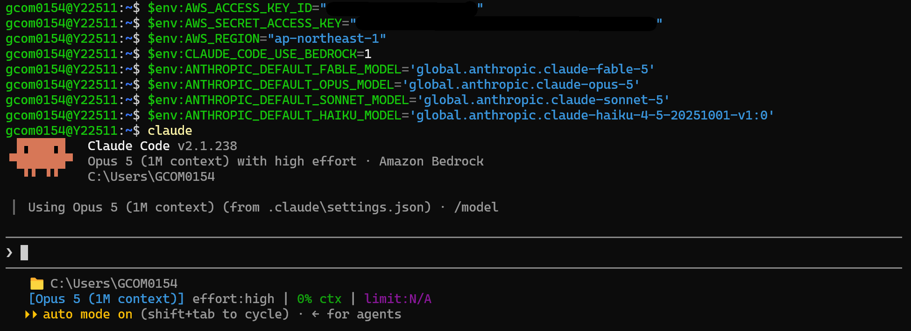

うまく動かない場合は、次のコマンドで設定状態を確認できます。

```powershell
claude doctor
```

### 利用上の注意

- Claude Code の利用コストも、チャット画面の利用と **合算** されて同じ上限（5時間／7日間）で管理されます。合計が上限を超えると、Bedrockの呼び出しが自動的に拒否されるようになります。
- Claude Code 側の利用量の集計は1時間ごとのバッチ処理で行われるため、チャット画面と違って **反映までに時間差** があります（最大で1日程度）。
- アクセスキーが漏えいした可能性がある場合は、ただちに管理者に連絡してください。

---

## 7. 困ったときは

| 症状 | 対応 |
|---|---|
| サインインすると「管理者の承認待ちです」と表示される | 管理者の承認が完了していません。管理者に連絡してください（→ [3章](#3-アカウント登録方法)） |
| アカウント作成でメールアドレスが弾かれる | `@gyoseiq.co.jp` のアドレスのみ登録できます |
| 確認コードのメールが届かない | 迷惑メールフォルダを確認し、数分待っても届かない場合は管理者に連絡してください |
| パスワードが分からない | サインイン画面の「パスワードを忘れましたか？」から再設定してください |
| メッセージを送っても応答が返らない／エラーになる | 利用量の上限に達していないか、画面左下の利用状況を確認してください。時間の経過で回復します |
| ファイルが添付できない | 対応形式・5ファイルまで・1ファイル4.5MBまでの制限を満たしているか確認してください |
| 画像を貼り付けられない | 選択中のモデルが画像に対応していない可能性があります。モデルを切り替えてください |
| ボットを作りたい | 権限の付与が必要です。管理者に依頼してください（→ [3章](#3-アカウント登録方法)） |
| APIで呼び出したい／APIキーが欲しい | 管理者に発行を依頼してください（→ [5章](#5-公開apiの使用方法)） |
| PowerShell で `claude` が見つからない | PowerShell を開き直してください。それでも解決しない場合は再インストールしてください（→ [6章](#6-claude-code-on-bedrock-の使用方法)） |
| Claude Code のアクセスキーが欲しい | 管理者に依頼してください（→ [6章](#6-claude-code-on-bedrock-の使用方法)） |

上記で解決しない場合は、社内の管理者にお問い合わせください。

<br>

<sub>※ 管理・運用担当者向けの情報は <a href="./docs/ADMINISTRATOR_ja-JP.md">docs/ADMINISTRATOR_ja-JP.md</a> を参照してください。</sub>
